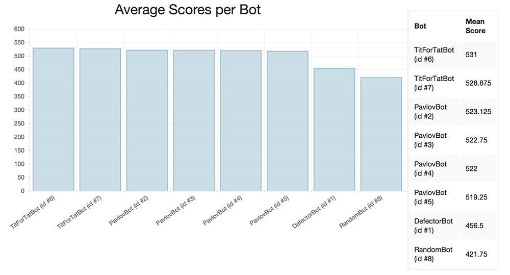

### Table of Contents

1. [Introduction](#introduction)
2. [Background](#background)
3. [Setup](#setup)
4. [Results](#results)
5. [Analysis](#analysis)
6. [Conclusion](#conclusion)

### Introduction

In the 1980s, University of Michigan professor of political science Robert Axelrod conducted one of the first experiments that combined computational modeling and evolutionary game theory. 

He solicited strategies (written as FORTRAN programs) from colleagues around the world for the iterated prisoner's dilemma and ran a round robin tournament, pitting the strategies against each other and determining a winner. His results that showed "nice" and "forgiving" strategies had greater success in the tournament. His experiments and collaboration with biologist W.D. Hamilton illustrated how cooperation could have evolved biologically. 

For this project, we attempted to recreate Axelrod's tournament in JavaScript with different sets of strategies. However, we find that if the set of all strategies do not meet certain constraints, cooperation will not evolve as it did in Axelrod's tournament.

### Background

The **Prisoner's Dilemma** is a classic example in game theory that illustrates how individual self-interest can lead to a poor outcome for a group. 

The prisoner's dilemma has 2 players (the "prisoners") who each have two options: cooperate or defect. These choices result in 4 possible outcomes with associated payoffs for each player. 

We define the following payoff values:

- $R$: reward for mutual cooperation (3 points)
- $T$: temptation to defect (5 points)
- $S$: sucker's payoff (0 points)
- $P$: punishment for mutual defection (1 point)

If both players cooperate, they both receive $R$ points. If one player cooperates and the other defects, the cooperator gets $S$ while the defector gets $T$ points. If both defect, they both get $P$ points. 

These values are otherwise arbitrary values selected to follow this constraint: $T > R > P > S$. Thus the temptation to defect is the highest score possible, the lowest score is the sucker's payoff, and the reward for mutual cooperation is higher than the punishment for mutual defection. The "dilemma" comes from the fact that mutual cooperation is preferable to mutual defection, but defection is the optimal strategy (i.e. mutual defection is a **Nash equilibrium**, a situation in which neither player can do better by changing his or her strategy). <a name="footnote1"></a><a href="#footnotes"><sup>1</sup></a>. The following table of payoffs are the values used in Axelrod's experiments and will be the same that are used for our simulations.

<table>
	<tr>
		<th></th>
		<th></th>
		<th colspan="2">Column Player</th>
	</tr>
	<tr>
		<th></th>
		<th></th>
		<th>Cooperate</th>
		<th>Defect</th>
	</tr>
	<tr>
		<th rowspan="2">Row Player</th>
		<th>Cooperate</th>
		<td>$(R = 3, R = 3)$</td>
		<td>$(S = 0, T = 5)$</td>
	</tr>
	<tr>
		<th>Defect</th>
		<td>$(T = 5, S = 0)$</td>
		<td>$(P = 1, P = 1)$</td>
	</tr>
</table>

In the table above, the first value in each tuple represents the score of the row player and the second represents the score of the column player.

**Iterated Prisoner's Dilemma** is then the same game played repeatedly by the same players. This allows for players to modify their behavior based on the other player's moves. 

In Axelrod's original tournament (14 strategies), the winning strategy was a simple strategy called Tit-for-Tat. It would cooperate initially and then mimic its opponent's last move. Axelrod then published the results and repeated the experiment, and received 64 submissions, with Tit-for-Tat winning again. Axelrod identified 4 features of the strategy that made it successful: 

1. *Niceness* - never being the first to defect
2. *Provocable* - retaliates quickly when opponent defects
3. *Forgiving* - cooperates again after retaliating
4. *Clear* - strategy is clear for other players to understand (and recognize as not exploitable) 

Other strategies submitted included variants on Tit-For-Tat that would retaliate more often or check to see if the opponent was playing randomly. 

### Setup

Similar iterated prisoner's dilemma simulations have been demonstrated in R <a name="footnote2"></a><a href="#footnotes"><sup>2</sup></a> and Python <a name="footnote3"></a><a href="#footnotes"><sup>3</sup></a>. Here, we attempt to use JavaScript to program the strategies so that the simulations can run in any web browser. 

Using object oriented programming, a Bot class is defined from which other bots with different strategies will be derived. Each bot keeps track of the history of its own moves, as well as a the score for each round that it plays against a single opponent. Each bot also has access to its opponent's history of moves. Moves are represented by the characters "C" for cooperate and "D" for defect. 

Here is the basic prototype for a generic Bot:

```
var Bot = function () {
	this.scores = [];
	this.history = [];
};
```

And here is an example of a derived bot which uses the Tit-for-Tat bot (the winning strategy described previously):

```
function TitForTatBot() {
	Bot.call(this);
	this.strategy = function(opponent) { 
		var moves = opponent.history.length;
		// if first move, cooperate
		if (moves === 0)
			return 'C'; 
		else 
			// mimic opponent's last move
			return opponent.history[moves-1];
	}
};
```

#### Strategies

For the initial tournament, we implemented the following strategies:

- **Defector**: Always defects
- **Cooperator**: Always cooperates
- **TitForTat**: Cooperates initially, and then mimic's opponent's last move
- **Random**: Cooperates (and defects) 50% of the time
- **Greedy**: Cooperates 25% of the time (independent of opponent)
- **Friendly**: Cooperates 75% of the time (independent of opponent)
- **Pavlov**: Cooperates initially, then repeats move if the last round turned out favorably (scored $R$ or $T$)
- **Vindictive**: Cooperates until opponent defects, then defects constantly

Each bot plays the other bot, including a clone of itself for 200 rounds. Thus the maximum score a bot can achieve is 1000 and the lowest score is 0. If two bots cooperate every round, their scores will be 600. 

### Results

The results of a simple tournament with just the Defector, Cooperator, and TitForTat is shown below.


We see that these initial results diverge from Axelrod's findings that "nice" strategies (ones that are never the first to defect) are better strategies as the Defector has the highest mean score of the tournament.

The following chart shows the results of the listed 8 strategies pitted against each other in the tournament.


We have that the Vindictive and Defector bots are the high scorers, helped by the fact that they exploit the Cooperator and Friendly bots, which do poorly. We do see evidence of "nice" strategies doing well overall. Vindictive, TitForTat, and Pavlov are "nice" strategies here (strategies that will never defect first) and they make up 3 of the top 4 scoring strategies. 

However, Tit For Tat does not fare as well as it did in Axelrod's original experiment and strategies that are the opposite of "nice" and "forgiving" are the high scorers. 

### Analysis

In Axelrod's original experiments, strategies that performed better tended to be more cooperative. They rarely defected first and were willing to cooperate even after the opponent had defected. The conclusions of the tournament suggested that cooperation could be evolutionary advantageous.

However, in simulations with simplified strategies, we see that cooperation is not necessarily the best strategy and the best strategies may even be to always defect or never forgive. If we consider all the different players and strategies an "environment", this suggests that certain environmental conditions need to hold in order for cooperation to evolve and the submissions Axelrod received met those conditions. 

Axelrod and biological literature <a name="footnote4"></a><a href="#footnotes"><sup>4</sup></a> outline certain conditions that are necessary for cooperation to evolve:

1. Individuals can recognize others and have the ability to remember prior interactions
2. Individuals must have repeated interactions over a long period of time
3. Successful strategies must be able to thrive and there needs to be variation in the strategies
4. There must be clusters of individuals that will meet and be willing to cooperate

In biology, these conditions turn out to be extremely restrictive, such that humans are among the only species that cooperate with other non-related individuals. Most other species do not have memory and recognition abilities to satisfy condition 1, nor have the lifespan or stable environment to satisfy condition 2. 

While the "environment" of our simulation does satisfy conditions 2-4 (interactions are repeated, strategies can survive, and there is variation of strategies) we see that the environment of our simulation did not satisfy the first condition, which explains why cooperation did not evolve to be the optimal strategy. Greedy, Friendly, Cooperator, Defector, and Random all had no ability to recognize and respond to what the opponent was doing and ignored previous history. This both prevents those individuals from recognizing others that are more likely to cooperate or those that are more likely to defect and playing accordingly.

Axelrod's original and followup tournament consisted largely of strategies, including Tit-For-Tat that in some way took into account what the opponent was doing. Absent the ability to recognize others and remember history, and cooperation does not evolve. 

To test this explanation, we can run a simulation consisting mostly of strategies that do have memory, such as Tit-For-Tat and Pavlov. Here, we have a simulation of a tournament with 2 Tit-For-Tats, 4 Pavlov's, and a Defector:



Here we see the bots without memory, Defector and Random, do poorly compared to the the rest and Tit-For-Tat now does come out on top when the environment has more individuals capable of cooperation. Even upon adding more defectors, Tit-For-Tat is able to find enough other individuals (the clusters as needed by condition 4) to cooperate with to win the tournament.

You can run your own tournaments at [http://simzou.github.io/iterated-prisoners-dilemma/simulation.html](http://simzou.github.io/iterated-prisoners-dilemma).

### Conclusion

Axelrod's original tournaments demonstrated how cooperation could evolve be a successful strategy within a group despite self-interested individuals. However, the environment of strategies has to be such that individual strategies are all capable of utilizing their knowledge of history with each other. When we pit strategies against each other that act independent of memory, the strategies with features Axelrod defined as good (such as being nice and forgiving) no longer perform as well.


<a id="footnotes"></a>
[1](#footnote1): Robert Axelrod and William D. Hamilton, *Science*. New Series, Vol. 211, No. 4489 (Mar. 27, 1981), pp. 1390-1396
[2](#footnote1): http://www.r-bloggers.com/to-cooperate-of-defect-besides-of-coding-prisoners-dilemma-a-game-theory-example-in-r/
[3](#footnote1): http://axelrod.readthedocs.org/en/latest/
[4](#footnote4): Phelan, Jay. *What Is Life?: A Guide to Biology.* New York, NY: W H Freeman, 2015. Print.


